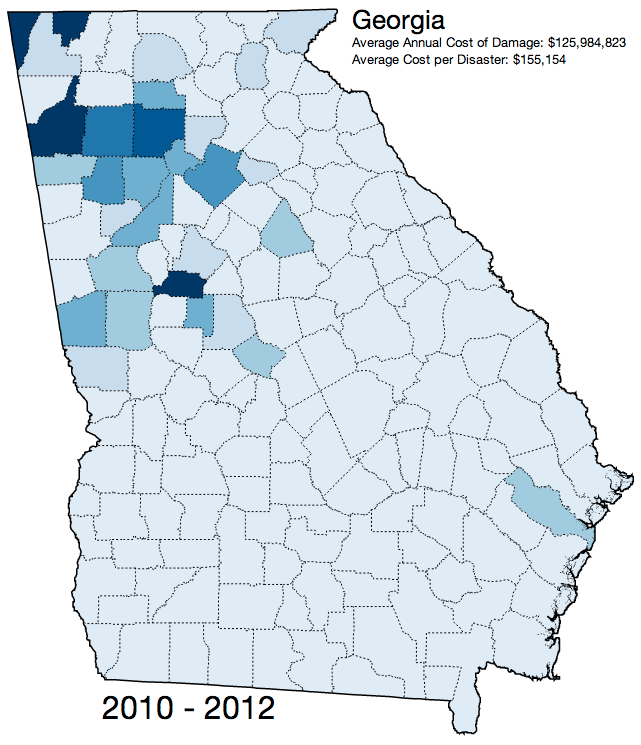

A D3.js choropleth example showing the costs of various natural disasters in the state of Georgia between 2010 and 2012.  The geometry data used to create the maps came from [diva-gis](http://www.diva-gis.org/gdata) and was parsed with OGR2OGR into GeoJSON and then into topoJSON (combining the county and state geometries into one data set).

Read the code [here](http://bl.ocks.org/mbeasley/6821149)

See the full working version [here](http://bl.ocks.org/mbeasley/raw/6821149/)

And download the code [here](https://github.com/mbeasley/ga-choropleth)

